# Windows 11 Endpoint Security Lab — Logbook

## 2026-07-08 — Part 1: Project setup

### Goal

Create the documentation structure for the Windows 11 Endpoint Security Lab.

The purpose of this part was to prepare the project folder, documentation files, screenshot folder, results folder, notes folder and Git repository before starting the endpoint security review.

### Work completed

* Created the main project folder.
* Created the documentation folders.
* Created `README.md`.
* Created `logbook.md`.
* Created `.gitkeep` files so Git can track empty folders.
* Opened the project in VS Code.
* Initialized the local Git repository.
* Created the GitHub repository.
* Connected the local repository to GitHub.
* Pushed the initial project structure to GitHub.
* Captured project structure screenshot evidence.
* Updated the README to mark Part 1 as complete.

### Project structure

```text
Windows-11-Endpoint-Security-Lab/
├── docs/
├── notes/
├── results/
├── screenshots/
├── scripts/
├── logbook.md
└── README.md
```

### Tools used

| Tool | Purpose |
| --- | --- |
| File Explorer | Used to create and review the project folder. |
| VS Code | Used to edit Markdown files and manage the project structure. |
| PowerShell terminal | Used to create folders, create files and run Git commands. |
| Git | Used for local version control. |
| GitHub | Used to publish the project as portfolio evidence. |

### Commands used

```powershell
mkdir docs, notes, results, screenshots, scripts
New-Item README.md, logbook.md -ItemType File
New-Item docs\.gitkeep, notes\.gitkeep, results\.gitkeep, screenshots\.gitkeep, scripts\.gitkeep -ItemType File
tree /F
git init
git add README.md logbook.md docs notes results screenshots scripts
git commit -m "Initial project setup"
git remote add origin https://github.com/YOUR-USERNAME/Windows-11-Endpoint-Security-Lab.git
git branch -M main
git push -u origin main
```

### Command purpose

| Command | Purpose |
| --- | --- |
| `mkdir docs, notes, results, screenshots, scripts` | Creates the main project folders. |
| `New-Item README.md, logbook.md -ItemType File` | Creates the starter README and logbook files. |
| `New-Item docs\.gitkeep, notes\.gitkeep, results\.gitkeep, screenshots\.gitkeep, scripts\.gitkeep -ItemType File` | Creates placeholder files so Git can track empty folders. |
| `tree /F` | Shows the project folder structure and files. |
| `git init` | Initializes the local Git repository. |
| `git add` | Stages files for commit. |
| `git commit` | Creates a local Git checkpoint. |
| `git remote add origin` | Connects the local repository to GitHub. |
| `git branch -M main` | Renames the current branch to main. |
| `git push -u origin main` | Uploads the first local commit to GitHub and links the local branch to the remote branch. |

### Screenshot evidence

#### Initial project structure


### Notes

This lab documents a basic Windows 11 endpoint security review in a safe local environment.

The project is designed for practical IT support, desktop support, endpoint support and junior sysadmin portfolio use.

The lab will use GUI tools first, followed by PowerShell verification where useful.

No real user data, production systems, passwords, private files or company devices are used.

---

## 2026-07-08 — Part 2: Windows Security baseline

### Goal

Review the main Windows Security dashboard in the Windows 11 lab VM and document the baseline state of the built-in endpoint security areas.

The purpose of this part was to learn where the main Windows 11 security areas are located and how Microsoft Defender status can be verified with PowerShell.

### Work completed

* Opened Windows Security from Windows Settings.
* Reviewed the Windows Security home dashboard.
* Reviewed Virus & threat protection.
* Reviewed Account protection.
* Reviewed Firewall & network protection.
* Reviewed App & browser control.
* Reviewed Device security.
* Opened PowerShell in the Windows 11 VM.
* Checked Microsoft Defender status with `Get-MpComputerStatus`.
* Created `results/windows-security-baseline-results.txt`.
* Captured screenshot evidence for the Windows Security baseline review.

### GUI paths used

```text
Start
→ Settings
→ Privacy & security
→ Windows Security
→ Open Windows Security
```

```text
Windows Security
→ Virus & threat protection
```

```text
Windows Security
→ Account protection
```

```text
Windows Security
→ Firewall & network protection
```

```text
Windows Security
→ App & browser control
```

```text
Windows Security
→ Device security
```

### Areas reviewed

| Area | Purpose |
| --- | --- |
| Windows Security home | Main dashboard for Windows 11 security status. |
| Virus & threat protection | Shows Microsoft Defender Antivirus status, current threats, scan options and protection updates. |
| Account protection | Shows account-related security options such as Microsoft account, Windows Hello and Dynamic lock. |
| Firewall & network protection | Shows firewall status for domain, private and public network profiles. |
| App & browser control | Shows reputation-based protection, exploit protection and browser/app security controls. |
| Device security | Shows hardware-backed security features such as Core isolation, security processor information and Secure Boot status where available. |

### PowerShell command used

```powershell
Get-MpComputerStatus
```

### Command purpose

| Command | Purpose |
| --- | --- |
| `Get-MpComputerStatus` | Shows Microsoft Defender Antivirus status, including whether antivirus, antispyware, behavior monitoring and real-time protection are enabled. It can also show information such as signature status and scan age. |

### Findings

| Check | Result |
| --- | --- |
| Windows Security home | Windows Security dashboard was opened and reviewed. |
| Virus & threat protection | Antivirus protection area was reviewed. |
| Account protection | Account security area was reviewed. |
| Firewall & network protection | Firewall profile area was reviewed. |
| App & browser control | App and browser protection area was reviewed. |
| Device security | Device security area was reviewed. |
| PowerShell Defender status | Microsoft Defender status was checked with `Get-MpComputerStatus`. |
| Results file | `results/windows-security-baseline-results.txt` was created. |

### Troubleshooting conclusion

The Windows Security baseline review was completed successfully.

This part demonstrated how to locate and review the main Windows 11 endpoint security areas using the graphical Windows Security interface, then confirm Microsoft Defender status using PowerShell.

Some security features may appear differently inside a virtual machine compared to physical hardware. Any unavailable or limited VM-specific features should be documented as lab findings, not treated as documentation errors.

### Screenshot evidence

#### Windows Security home


#### Virus & threat protection


#### Account protection


#### Firewall & network protection


#### App & browser control


#### Device security


#### Defender PowerShell status


### Results file

| File | Description |
| --- | --- |
| results/windows-security-baseline-results.txt | Contains the written Windows Security baseline findings and conclusion. |

### Notes

This part focused on GUI-first endpoint security review.

Windows Security is the normal graphical dashboard that a helpdesk technician or junior sysadmin can use to inspect built-in Windows protection areas. PowerShell was used afterward to confirm Defender status with command-line evidence.


---

## 2026-07-08 — Part 3: Windows Firewall review

### Goal

Review Windows Defender Firewall status and basic firewall configuration in the Windows 11 lab VM.

The purpose of this part was to inspect the firewall through the Windows Security graphical interface, review the active network profile, check allowed apps through the firewall and verify firewall profile settings with PowerShell.

### Work completed

* Opened Windows Security from Windows Settings.
* Opened Firewall & network protection.
* Reviewed the available firewall network profiles.
* Opened the active firewall network profile.
* Reviewed Microsoft Defender Firewall status for the active profile.
* Reviewed the allowed apps through firewall view.
* Opened PowerShell in the Windows 11 VM.
* Checked firewall profile status with `Get-NetFirewallProfile`.
* Listed a sample of firewall rules with `Get-NetFirewallRule | Select-Object -First 10`.
* Created `results/windows-firewall-review-results.txt`.
* Captured screenshot evidence for the Windows Firewall review.

### GUI paths used

```text
Start
→ Settings
→ Privacy & security
→ Windows Security
→ Open Windows Security
```

```text
Windows Security
→ Firewall & network protection
```

```text
Firewall & network protection
→ Active network profile
```

```text
Firewall & network protection
→ Allow an app through firewall
```

### Areas reviewed

| Area | Purpose |
| --- | --- |
| Firewall & network protection | Shows Windows Defender Firewall status for domain, private and public network profiles. |
| Domain network | Firewall profile normally used when connected to an Active Directory domain network. |
| Private network | Firewall profile normally used for trusted home, lab or internal networks. |
| Public network | Firewall profile normally used for untrusted networks such as cafés, hotels or public Wi-Fi. |
| Active firewall profile | Shows the firewall settings currently applied to the active network connection. |
| Allowed apps through firewall | Shows applications allowed to communicate through Windows Defender Firewall. |

### PowerShell commands used

```powershell
Get-NetFirewallProfile
Get-NetFirewallRule | Select-Object -First 10
```

### Command purpose

| Command | Purpose |
| --- | --- |
| `Get-NetFirewallProfile` | Shows firewall configuration for the Domain, Private and Public profiles, including whether each profile is enabled. |
| `Get-NetFirewallRule` | Lists Windows Defender Firewall rules. |
| `Select-Object -First 10` | Limits the output to the first 10 firewall rules so the terminal output remains readable. |

### Findings

| Check | Result |
| --- | --- |
| Firewall & network protection | Opened and reviewed successfully. |
| Network profiles | Domain, Private and Public firewall profiles were reviewed. |
| Active profile | The active firewall network profile was opened and reviewed. |
| Defender Firewall status | Firewall status for the active profile was reviewed. |
| Allowed apps | The allowed apps through firewall list was opened and reviewed. |
| PowerShell profile check | Firewall profiles were checked with `Get-NetFirewallProfile`. |
| PowerShell rule sample | A sample of firewall rules was listed with `Get-NetFirewallRule`. |
| Results file | `results/windows-firewall-review-results.txt` was created. |

### Troubleshooting conclusion

The Windows Firewall review was completed successfully.

This part demonstrated how to review Windows Defender Firewall status using the Windows Security GUI and how to verify firewall profiles and firewall rules using PowerShell.

The active network profile may differ depending on the Windows 11 VM network configuration. A lab VM may show Private or Public as the active profile, and that should be documented as the observed lab state.

### Screenshot evidence

#### Firewall & network protection

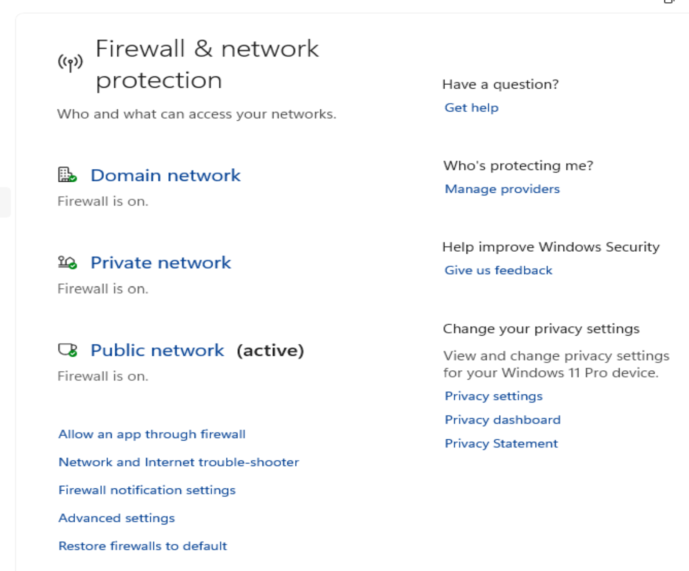

#### Active firewall profile

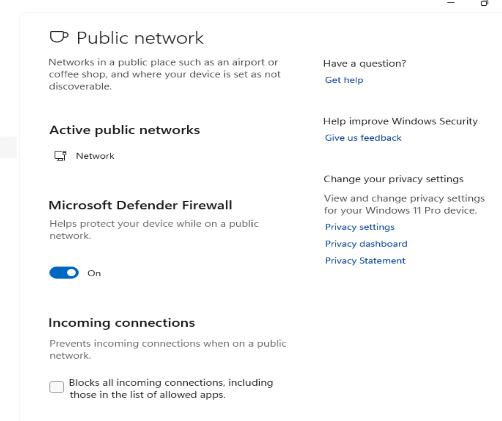

#### Allowed apps through firewall

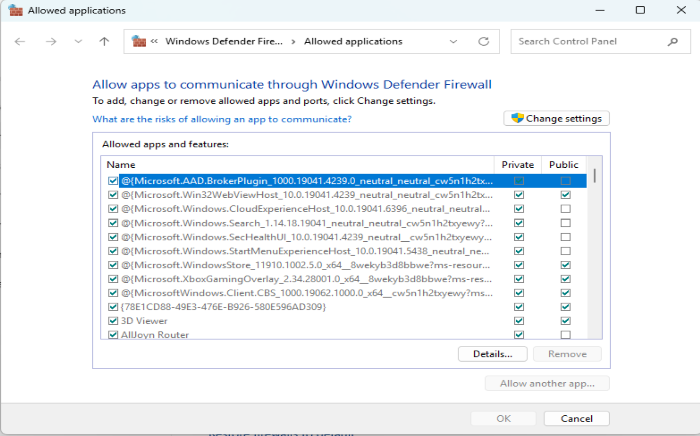

#### PowerShell firewall profiles

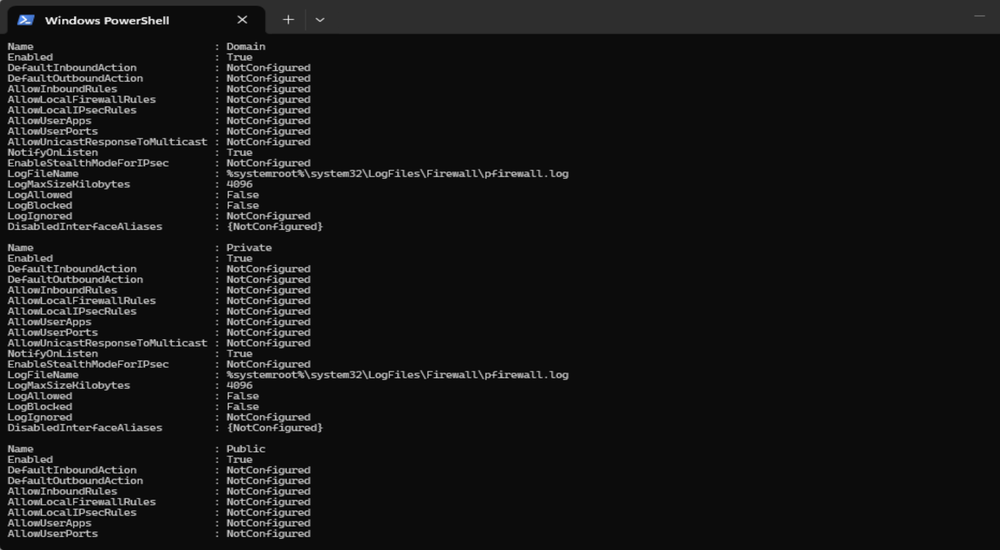

#### PowerShell firewall rules

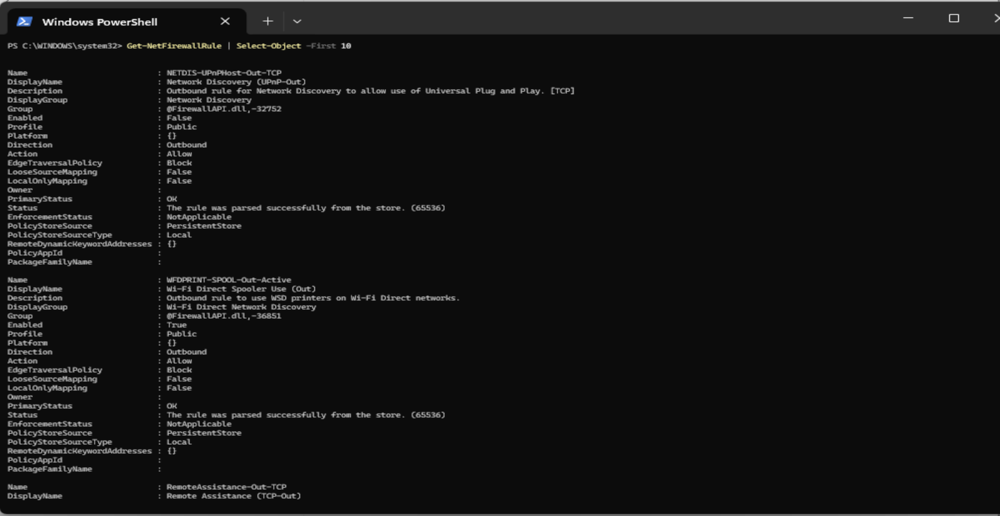

### Results file

| File | Description |
| --- | --- |
| results/windows-firewall-review-results.txt | Contains the written Windows Firewall review findings and conclusion. |

### Notes

This part focused on Windows Defender Firewall as a core endpoint security control.

The GUI review shows where a technician can inspect firewall status and allowed apps. PowerShell verification provides command-line evidence of firewall profile configuration and firewall rules.

---

## 2026-07-08 — Part 4: UAC and admin rights review

### Goal

Review User Account Control settings and local administrator membership in the Windows 11 lab VM.

The purpose of this part was to inspect how Windows handles elevation prompts, local accounts and administrator group membership using GUI tools first, followed by PowerShell verification.

### Work completed

* Opened User Account Control settings.
* Reviewed the UAC notification level.
* Opened Computer Management.
* Opened Local Users and Groups.
* Reviewed local users.
* Opened the lab user account properties.
* Reviewed the local Administrators group members.
* Opened PowerShell in the Windows 11 VM.
* Listed local users with `Get-LocalUser`.
* Listed local Administrators group members with `Get-LocalGroupMember Administrators`.
* Created `results/uac-admin-rights-review-results.txt`.
* Captured screenshot evidence for the UAC and admin rights review.

### GUI paths used

```text
Start
→ Search
→ Change User Account Control settings
```

```text
Start
→ Search
→ Computer Management
```

```text
Win + R
→ compmgmt.msc
```

```text
Computer Management
→ System Tools
→ Local Users and Groups
→ Users
```

```text
Computer Management
→ System Tools
→ Local Users and Groups
→ Groups
→ Administrators
```

### Areas reviewed

| Area | Purpose |
| --- | --- |
| User Account Control settings | Shows the Windows notification level for administrative elevation prompts. |
| Computer Management | Windows administrative console used to review local system management areas. |
| Local Users and Groups | Shows local user accounts and local groups on the Windows machine. |
| Local user properties | Shows account details and group membership for a selected local user. |
| Administrators group | Shows accounts with local administrator rights on the machine. |

### PowerShell commands used

```powershell
Get-LocalUser
Get-LocalGroupMember Administrators
```

### Command purpose

| Command | Purpose |
| --- | --- |
| `Get-LocalUser` | Lists local user accounts on the Windows machine. |
| `Get-LocalGroupMember Administrators` | Lists members of the local Administrators group. |

### Findings

| Check | Result |
| --- | --- |
| UAC settings | User Account Control settings were opened and reviewed. |
| Computer Management | Computer Management was opened successfully. |
| Local users | Local users were reviewed through the GUI. |
| Local user properties | The lab user account properties were reviewed. |
| Administrators group | Local Administrators group membership was reviewed. |
| PowerShell user check | Local users were listed with `Get-LocalUser`. |
| PowerShell admin group check | Administrators group members were listed with `Get-LocalGroupMember Administrators`. |
| Results file | `results/uac-admin-rights-review-results.txt` was created. |

### Troubleshooting conclusion

The UAC and admin rights review was completed successfully.

This part demonstrated how to inspect User Account Control settings and verify local administrator membership using both GUI tools and PowerShell.

Local administrator rights should always be reviewed carefully. In a lab VM, the lab user may have administrator rights so the technician can perform setup and troubleshooting tasks. In a real endpoint environment, unnecessary local administrator access should be avoided.

### Screenshot evidence

#### User Account Control settings

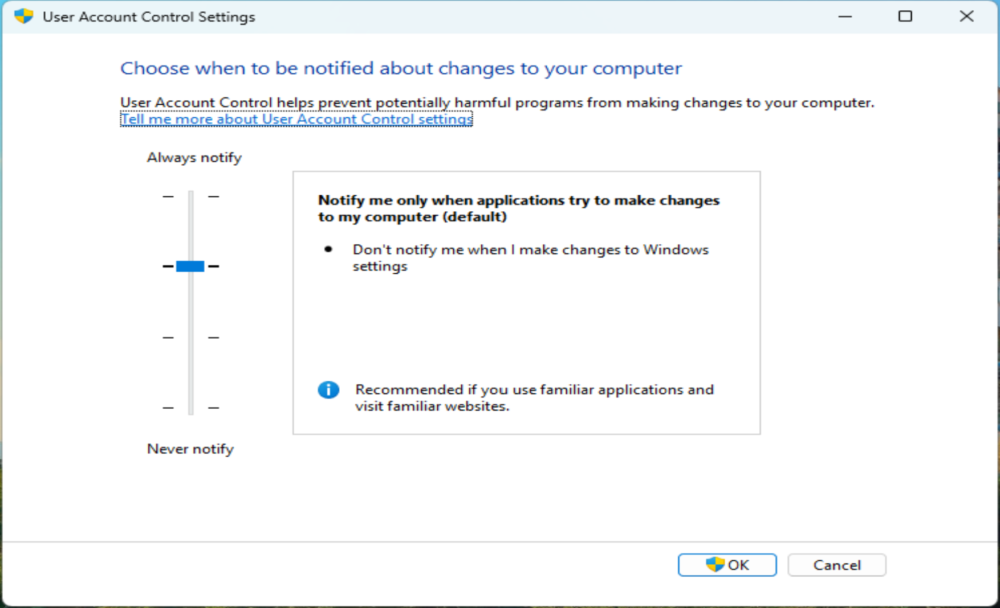

#### Computer Management local users

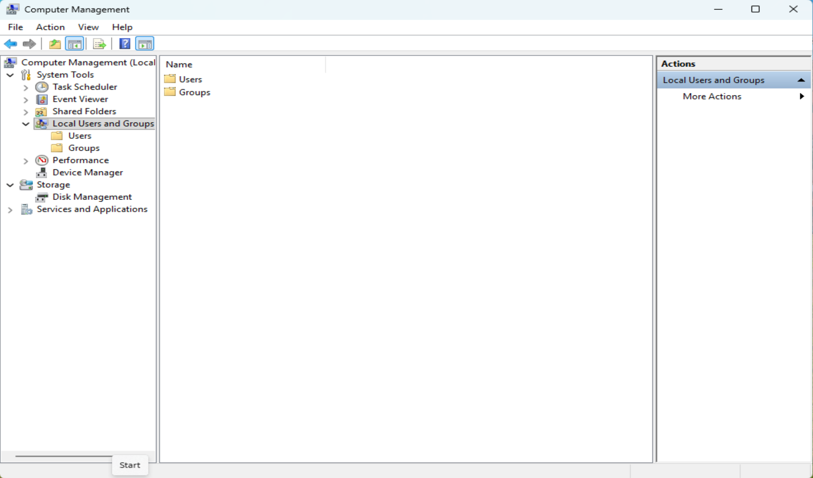

#### Local user properties

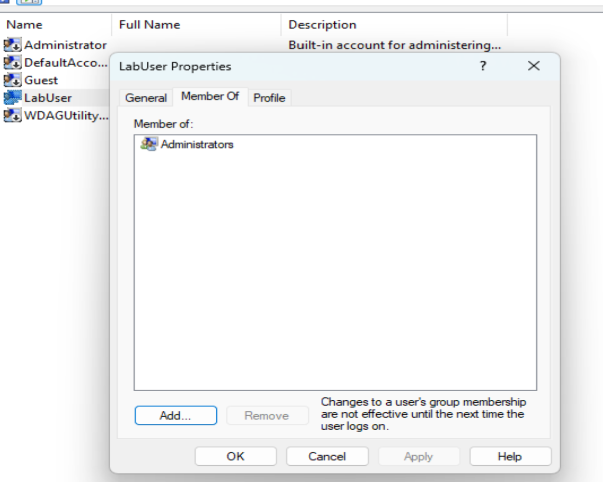

#### Administrators group members

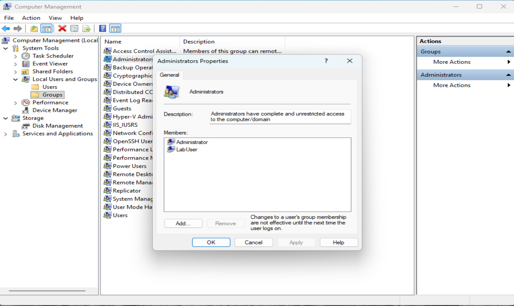

#### PowerShell local users

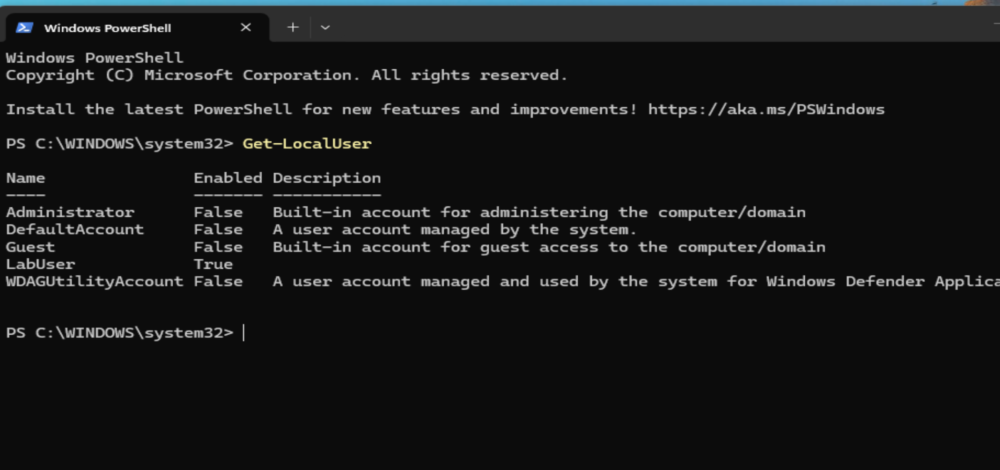

#### PowerShell Administrators group

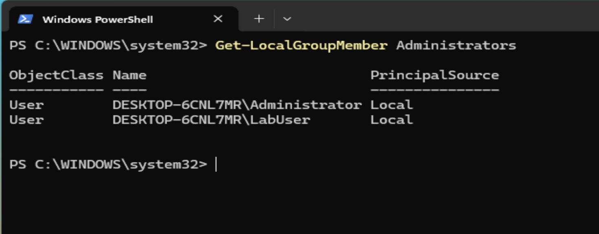

### Results file

| File | Description |
| --- | --- |
| results/uac-admin-rights-review-results.txt | Contains the written UAC and admin rights review findings and conclusion. |

### Notes

This part focused on account elevation and local administrator access as endpoint security controls.

UAC helps reduce silent system-level changes by requiring confirmation for administrative actions. Local administrator membership is important because accounts with local admin rights can make system-wide changes.

---

## 2026-07-08 — Part 5: BitLocker or device encryption review

### Goal

Review BitLocker or Device encryption availability and drive encryption status in the Windows 11 lab VM.

The purpose of this part was to check whether Windows drive encryption features were available in the VM and verify the encryption state using GUI tools and command-line tools.

### Work completed

* Opened or searched for Device encryption settings.
* Reviewed BitLocker Drive Encryption in Control Panel.
* Opened PowerShell in the Windows 11 VM.
* Ran `manage-bde -status` to check BitLocker drive encryption status.
* Confirmed that `manage-bde -status` required administrative rights when run without elevation.
* Ran `manage-bde -status` again from an elevated PowerShell session.
* Checked BitLocker volume status with `Get-BitLockerVolume`.
* Created `results/bitlocker-device-encryption-review-results.txt`.
* Captured screenshot evidence for the BitLocker or device encryption review.

### GUI paths used

```text
Start
→ Settings
→ Privacy & security
→ Device encryption
```

```text
Start
→ Search
→ Device encryption
```

```text
Start
→ Search
→ Control Panel
→ System and Security
→ BitLocker Drive Encryption
```

```text
Win + R
→ control
→ System and Security
→ BitLocker Drive Encryption
```

### Areas reviewed

| Area | Purpose |
| --- | --- |
| Device encryption settings | Shows whether Windows Device encryption is available and enabled. |
| BitLocker Drive Encryption | Shows BitLocker status and management options for available drives. |
| System drive encryption status | Shows whether the Windows system drive is encrypted, decrypted or protected. |
| Elevated PowerShell session | Allows BitLocker management commands that require administrative rights. |

### Commands used

```powershell
manage-bde -status
Get-BitLockerVolume
```

### Command purpose

| Command | Purpose |
| --- | --- |
| `manage-bde -status` | Shows BitLocker status for available volumes, including encryption state and protection status. |
| `Get-BitLockerVolume` | Shows BitLocker volume information through PowerShell, including mount point, volume status, protection status and encryption percentage where available. |

### Findings

| Check | Result |
| --- | --- |
| Device encryption settings | Device encryption settings were opened or searched for in Windows Settings. |
| BitLocker Control Panel | BitLocker Drive Encryption was reviewed in Control Panel. |
| Non-admin manage-bde check | `manage-bde -status` required administrative rights when run without elevation. |
| Admin manage-bde check | `manage-bde -status` was run from an elevated PowerShell session. |
| PowerShell BitLocker check | BitLocker volume status was checked with `Get-BitLockerVolume`. |
| Results file | `results/bitlocker-device-encryption-review-results.txt` was created. |

### Troubleshooting conclusion

The BitLocker or device encryption review was completed successfully.

This part demonstrated how to check whether Windows drive encryption features are available and how to verify encryption status using Windows Settings, Control Panel and PowerShell.

BitLocker or Device encryption may behave differently in a virtual machine compared to physical hardware. If encryption is unavailable, disabled or limited in the VM, this should be documented as the observed lab state, not treated as an error.

### Screenshot evidence

#### Device encryption settings

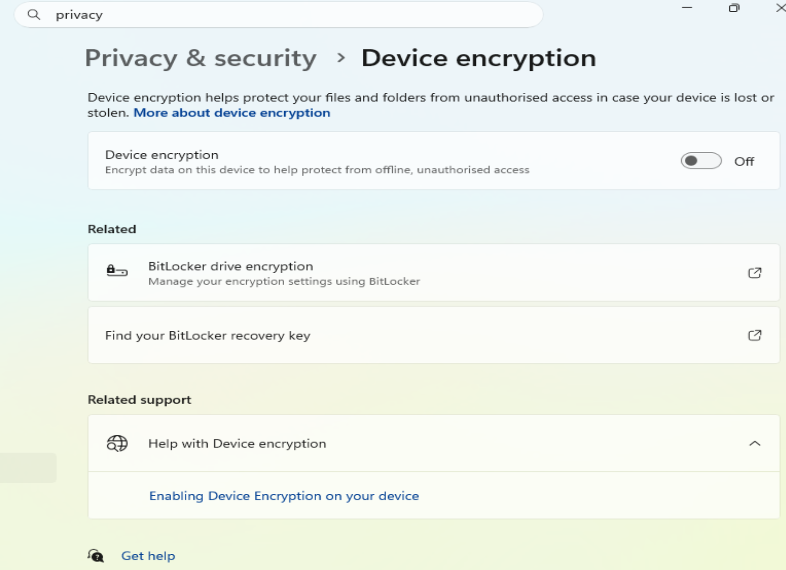

#### BitLocker Control Panel

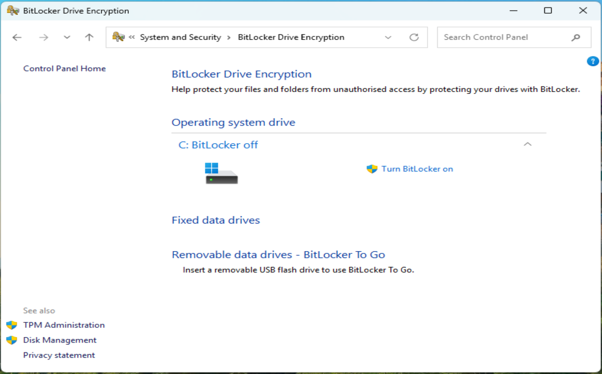

#### Manage-bde status as administrator

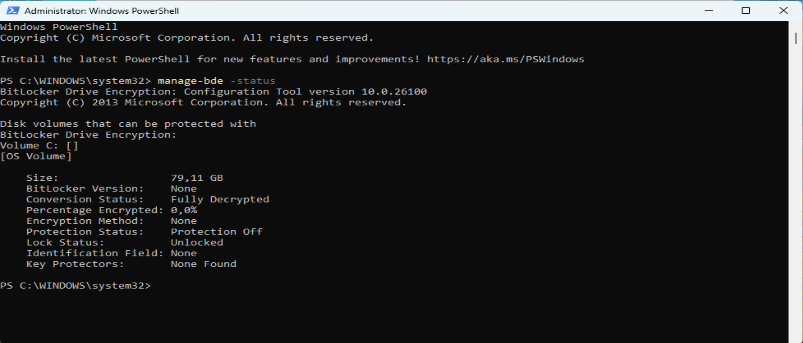

#### PowerShell BitLocker volume

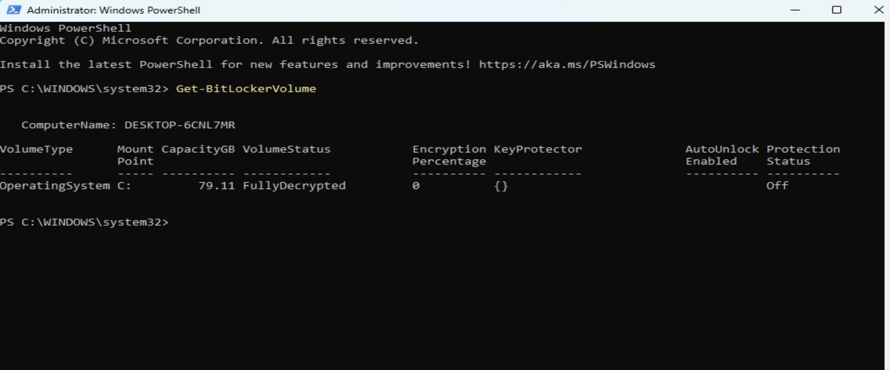

### Results file

| File | Description |
| --- | --- |
| results/bitlocker-device-encryption-review-results.txt | Contains the written BitLocker or device encryption review findings and conclusion. |

### Notes

This part focused on disk encryption as an endpoint security control.

Disk encryption helps protect data if a device is lost, stolen or accessed offline. In a lab VM, encryption features may be unavailable, disabled or limited depending on Windows edition, virtual hardware and configuration.

Some BitLocker commands require administrative rights. If access is denied in a normal PowerShell session, the command should be rerun from PowerShell opened as Administrator.

---

## 2026-07-08 — Part 6: Apps and startup review

### Goal

Review installed applications and startup apps in the Windows 11 lab VM.

The purpose of this part was to inspect installed software and startup items using Windows Settings, Task Manager and PowerShell.

### Work completed

* Opened Installed apps in Windows Settings.
* Reviewed installed applications.
* Opened Startup apps in Windows Settings.
* Reviewed apps configured to start automatically when the user signs in.
* Opened Task Manager.
* Reviewed Startup apps in Task Manager.
* Opened PowerShell in the Windows 11 VM.
* Listed installed applications from the Windows Registry with PowerShell.
* Listed startup commands with PowerShell.
* Created `results/apps-startup-review-results.txt`.
* Captured screenshot evidence for the apps and startup review.

### GUI paths used

```text
Start
→ Settings
→ Apps
→ Installed apps
```

```text
Start
→ Settings
→ Apps
→ Startup
```

```text
Ctrl + Shift + Esc
→ Startup apps
```

```text
Start
→ Search
→ Task Manager
→ Startup apps
```

### Areas reviewed

| Area | Purpose |
| --- | --- |
| Installed apps | Shows applications installed on the Windows machine. |
| Startup apps in Settings | Shows apps configured to start automatically when the user signs in. |
| Startup apps in Task Manager | Shows startup apps, publisher information, status and startup impact where available. |
| Installed applications through PowerShell | Provides command-line evidence of installed application entries. |
| Startup commands through PowerShell | Provides command-line evidence of startup commands configured on the machine. |

### PowerShell commands used

```powershell
Get-ItemProperty HKLM:\Software\Microsoft\Windows\CurrentVersion\Uninstall\* | Select-Object DisplayName, DisplayVersion, Publisher
Get-CimInstance Win32_StartupCommand
```

### Command purpose

| Command | Purpose |
| --- | --- |
| `Get-ItemProperty HKLM:\Software\Microsoft\Windows\CurrentVersion\Uninstall\* \| Select-Object DisplayName, DisplayVersion, Publisher` | Lists installed application entries from the Windows Registry and shows selected fields such as name, version and publisher. |
| `Get-CimInstance Win32_StartupCommand` | Lists startup commands configured on the Windows machine. |

### Findings

| Check | Result |
| --- | --- |
| Installed apps | Installed apps were opened and reviewed in Windows Settings. |
| Startup apps in Settings | Startup apps were opened and reviewed in Windows Settings. |
| Task Manager startup apps | Startup apps were reviewed in Task Manager. |
| PowerShell installed apps check | Installed application entries were listed with PowerShell. |
| PowerShell startup commands check | Startup commands were listed with PowerShell. |
| Results file | `results/apps-startup-review-results.txt` was created. |

### Troubleshooting conclusion

The apps and startup review was completed successfully.

This part demonstrated how to review installed applications and startup items using both GUI tools and PowerShell.

Installed apps and startup items should be reviewed during endpoint security checks because unknown, unnecessary or unwanted software can increase risk or affect system performance.

### Screenshot evidence

#### Installed apps in Settings

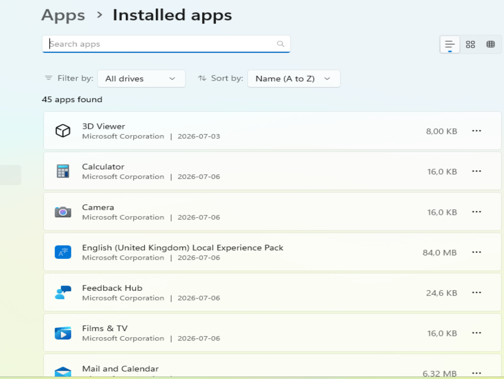

#### Startup apps in Settings

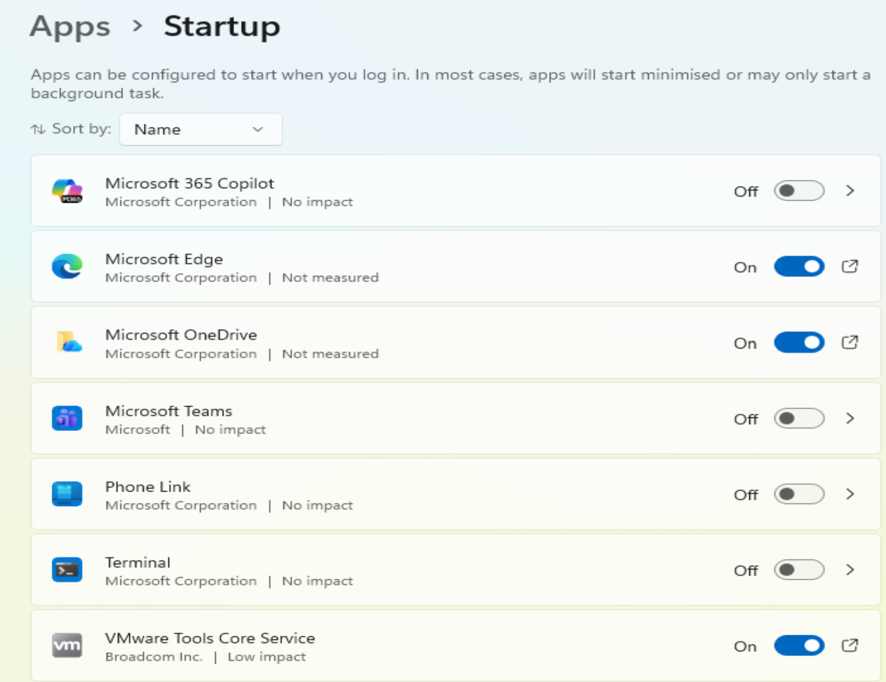

#### Startup apps in Task Manager

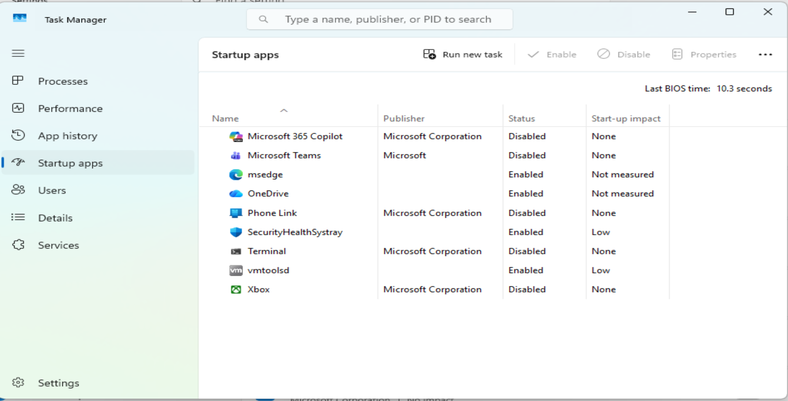

#### PowerShell installed apps

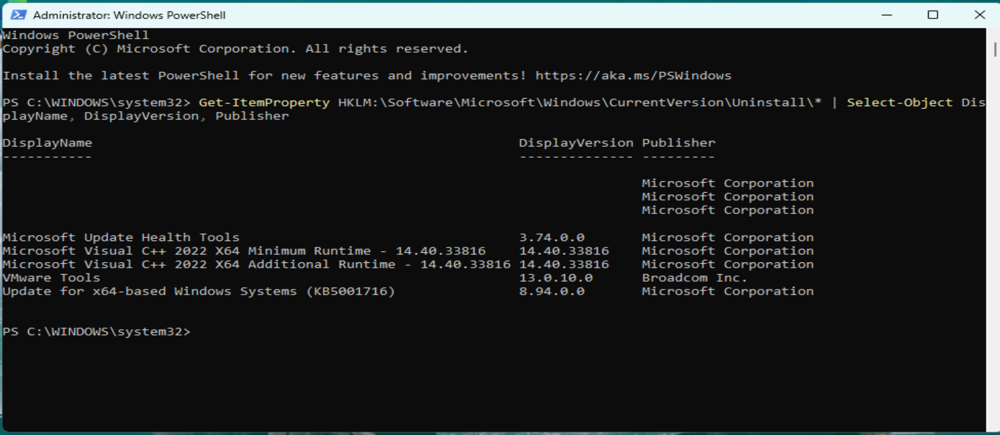

#### PowerShell startup commands

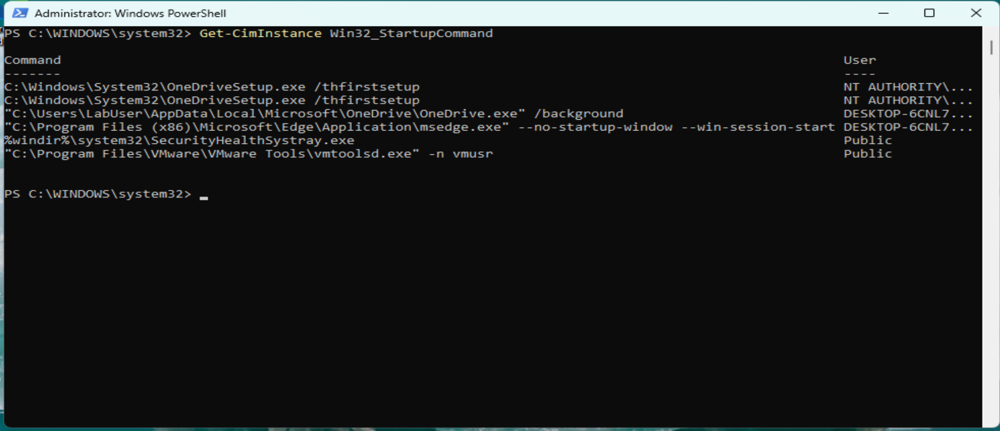

### Results file

| File | Description |
| --- | --- |
| results/apps-startup-review-results.txt | Contains the written apps and startup review findings and conclusion. |

### Notes

This part focused on software inventory and startup behavior as endpoint security review areas.

Unknown or unnecessary installed applications can increase risk. Startup apps and startup commands should also be reviewed because they can affect performance, persistence and the user sign-in experience. In a lab VM, Microsoft components, VMware tools and normal built-in Windows apps are expected unless something unusual is observed.

---

## 2026-07-08 — Part 7: Security Event Viewer review

### Goal

Review Windows Security event logs in the Windows 11 lab VM.

The purpose of this part was to inspect Security log activity using Event Viewer, filter for logon-related events and verify Security log access with PowerShell.

### Work completed

* Opened Event Viewer.
* Opened Windows Logs.
* Opened the Security log.
* Reviewed recent Security events.
* Opened Filter Current Log.
* Filtered the Security log for logon-related event IDs.
* Reviewed filtered Security events.
* Opened a Security event with Event ID 4672.
* Reviewed the event General and Details information.
* Opened PowerShell in the Windows 11 VM.
* Checked Security log access with `Get-WinEvent -LogName Security -MaxEvents 10`.
* Created `results/security-event-viewer-review-results.txt`.
* Captured screenshot evidence for the Security Event Viewer review.

### GUI paths used

```text
Start
→ Search
→ Event Viewer
```

```text
Win + R
→ eventvwr.msc
```

```text
Event Viewer
→ Windows Logs
→ Security
```

```text
Security log
→ Filter Current Log
```

### Event IDs reviewed

| Event ID | Meaning |
| --- | --- |
| 4624 | Successful logon. |
| 4625 | Failed logon. |
| 4634 | Logoff. |
| 4672 | Special privileges assigned to a new logon. |

### Areas reviewed

| Area | Purpose |
| --- | --- |
| Event Viewer | Windows tool used to review system, application and security logs. |
| Security log | Windows audit log used to review security-related events. |
| Recent Security events | Shows recent audit activity on the system. |
| Filter Current Log | Used to filter Security log events by event ID. |
| Event details | Shows readable and structured information about a selected event. |
| PowerShell Security log access | Provides command-line verification that the Security log can be queried. |

### PowerShell command used

```powershell
Get-WinEvent -LogName Security -MaxEvents 10
```

### Command purpose

| Command | Purpose |
| --- | --- |
| `Get-WinEvent` | Reads Windows event logs. |
| `-LogName Security` | Selects the Security log. |
| `-MaxEvents 10` | Limits output to the 10 newest events so the result stays readable. |

### Findings

| Check | Result |
| --- | --- |
| Event Viewer | Event Viewer was opened successfully. |
| Security log | The Security log was opened and reviewed. |
| Recent events | Recent Security events were reviewed. |
| Filter Current Log | The Security log was filtered for logon-related events. |
| Filtered events | Filtered logon-related events were reviewed. |
| Event details | Event ID 4672 was opened and reviewed. |
| Details tab | The Details tab showed structured event data, including SYSTEM / NT AUTHORITY and a privilege list. |
| PowerShell Security log check | Security log access was checked with `Get-WinEvent -LogName Security -MaxEvents 10`. |
| Results file | `results/security-event-viewer-review-results.txt` was created. |

### Troubleshooting conclusion

The Security Event Viewer review was completed successfully.

This part demonstrated how to inspect Windows Security logs using Event Viewer and how to verify Security log access with PowerShell.

Event ID 4672 is commonly associated with special privileges being assigned to a new logon. Seeing SYSTEM / NT AUTHORITY in this context can be normal Windows activity and is not automatically a security problem.

### Screenshot evidence

#### Event Viewer Security log

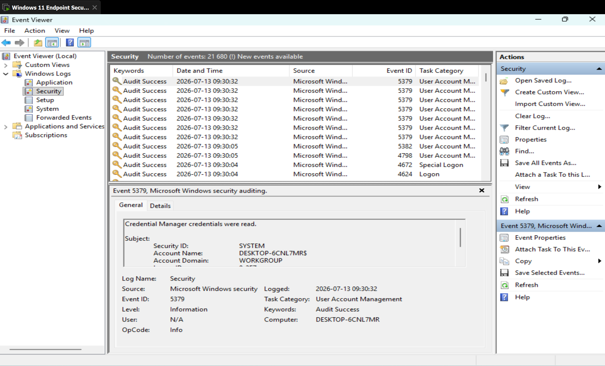

#### Security log recent events

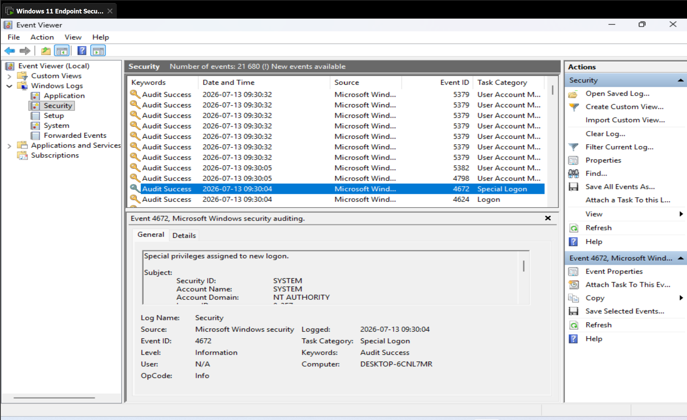

#### Security log filter current log

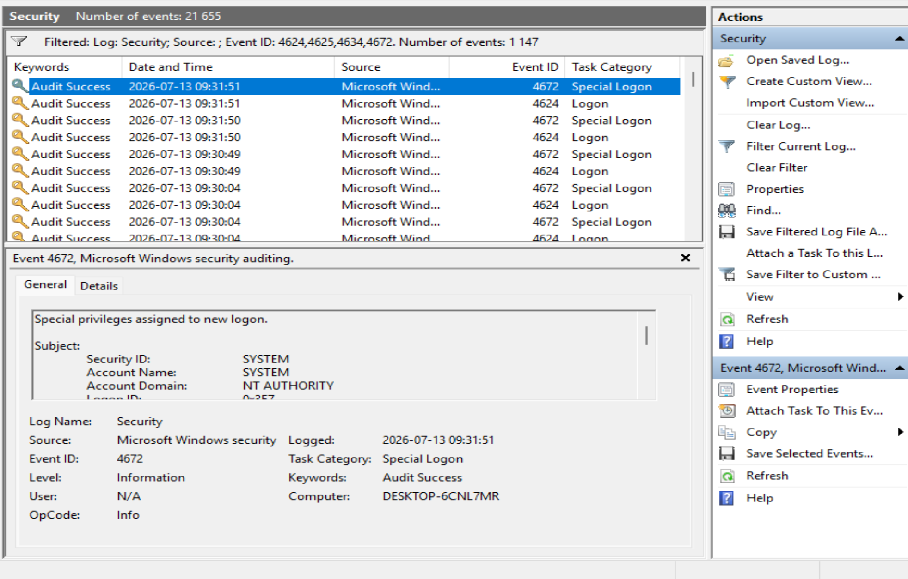

#### Security log filtered logon events

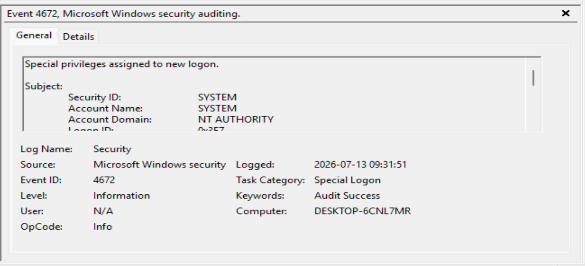

#### Security event details

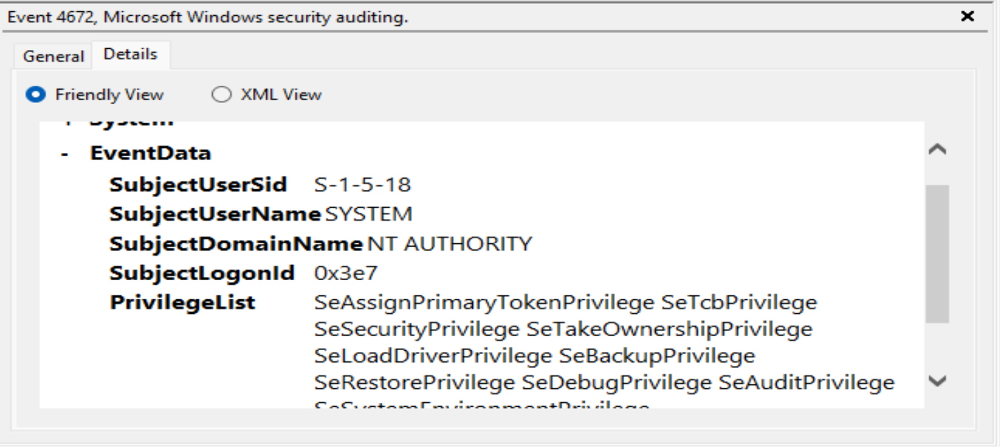

#### PowerShell Security log

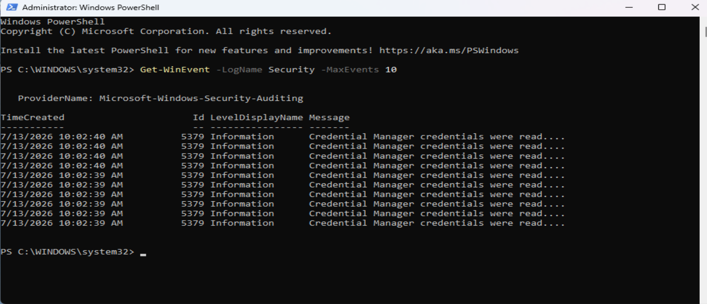

### Results file

| File | Description |
| --- | --- |
| results/security-event-viewer-review-results.txt | Contains the written Security Event Viewer review findings and conclusion. |

### Notes

This part focused on Security event log review as an endpoint security investigation skill.

Security log contents may differ depending on VM activity, audit policy and account activity. Event Viewer findings should be interpreted with context and not treated as proof of an active issue by themselves.
