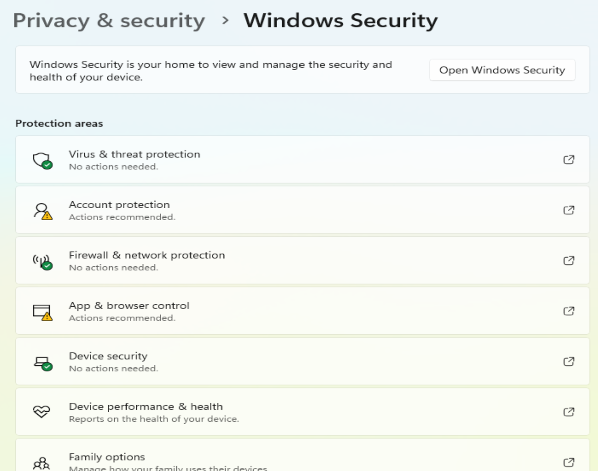
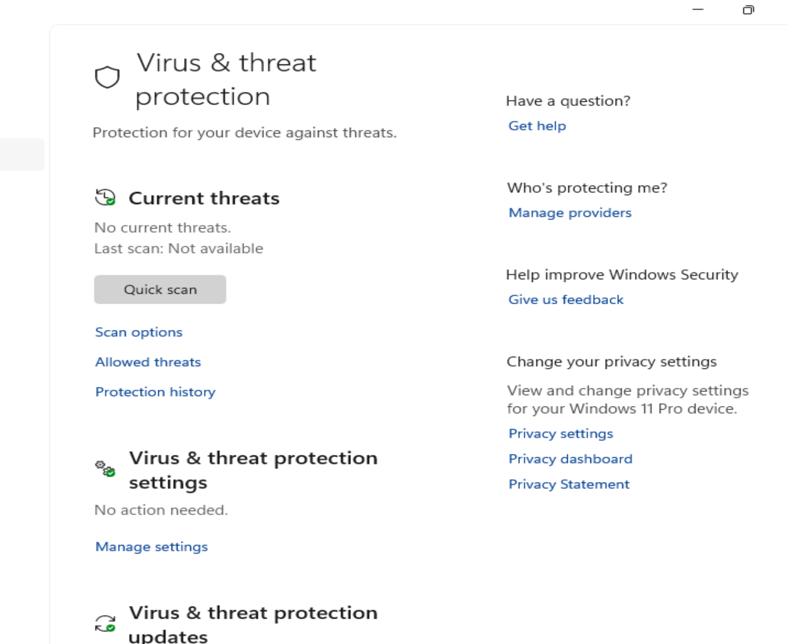
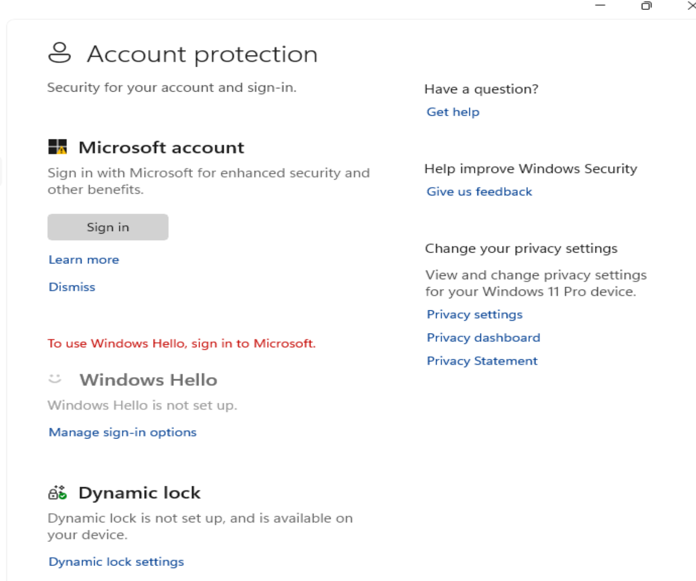
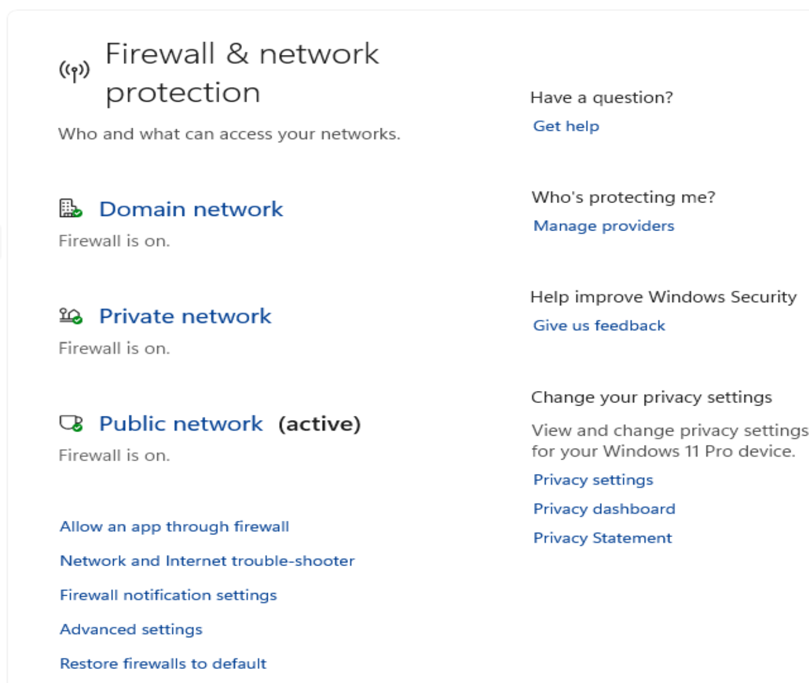
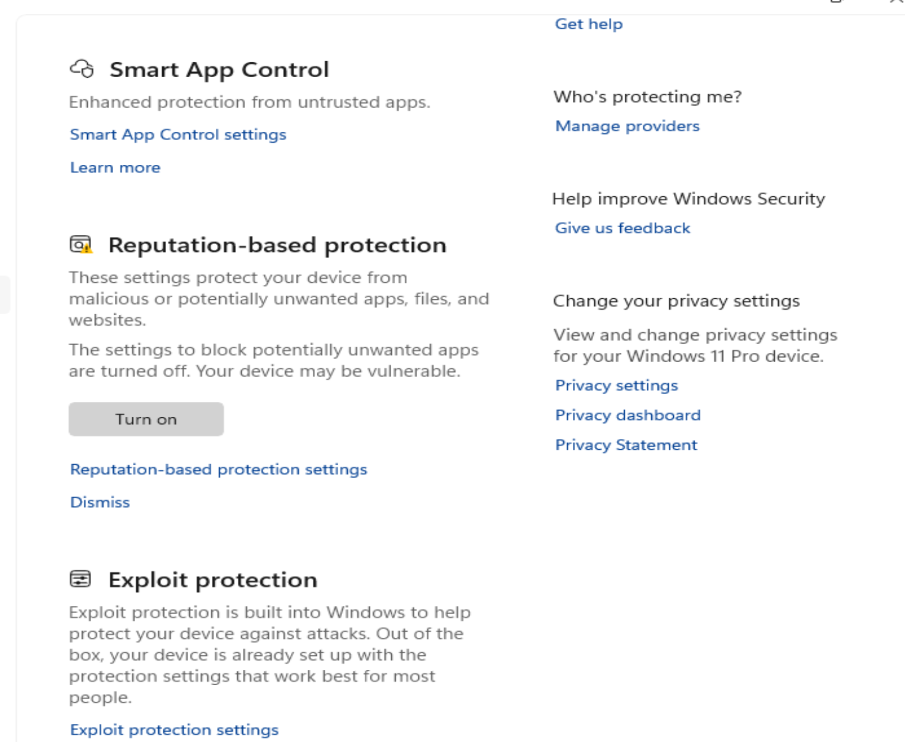
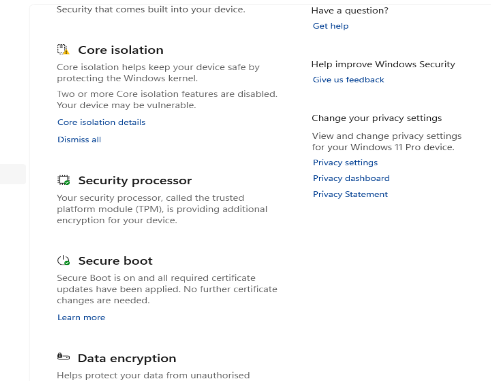
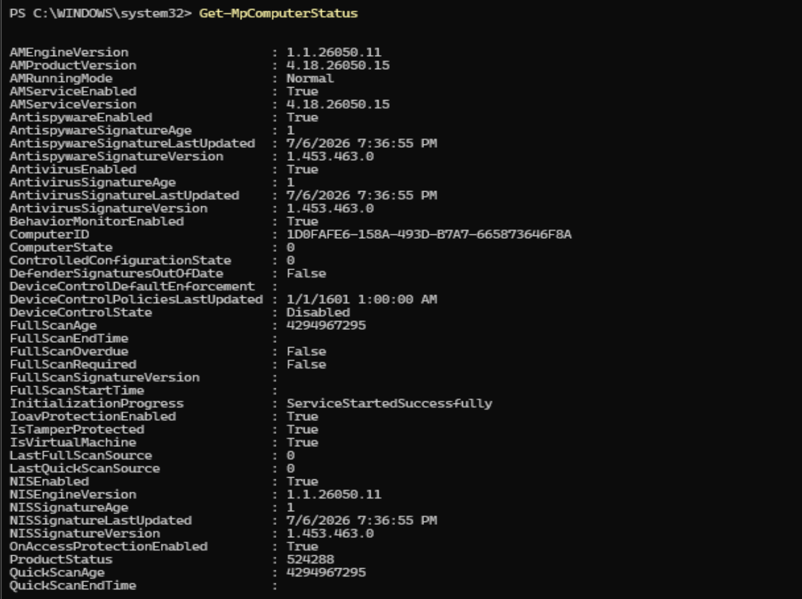

# Windows 11 Endpoint Security Lab — Logbook

## 2026-07-08 — Part 1: Project setup

### Goal

Create the documentation structure for the Windows 11 Endpoint Security Lab.

The purpose of this part was to prepare the project folder, documentation files, screenshot folder, results folder, notes folder and Git repository before starting the endpoint security review.

### Work completed

* Created the main project folder.
* Created the documentation folders.
* Created `README.md`.
* Created `logbook.md`.
* Created `.gitkeep` files so Git can track empty folders.
* Opened the project in VS Code.
* Initialized the local Git repository.
* Created the GitHub repository.
* Connected the local repository to GitHub.
* Pushed the initial project structure to GitHub.
* Captured project structure screenshot evidence.
* Updated the README to mark Part 1 as complete.

### Project structure

```text
Windows-11-Endpoint-Security-Lab/
├── docs/
├── notes/
├── results/
├── screenshots/
├── scripts/
├── logbook.md
└── README.md
```

### Tools used

| Tool | Purpose |
| --- | --- |
| File Explorer | Used to create and review the project folder. |
| VS Code | Used to edit Markdown files and manage the project structure. |
| PowerShell terminal | Used to create folders, create files and run Git commands. |
| Git | Used for local version control. |
| GitHub | Used to publish the project as portfolio evidence. |

### Commands used

```powershell
mkdir docs, notes, results, screenshots, scripts
New-Item README.md, logbook.md -ItemType File
New-Item docs\.gitkeep, notes\.gitkeep, results\.gitkeep, screenshots\.gitkeep, scripts\.gitkeep -ItemType File
tree /F
git init
git add README.md logbook.md docs notes results screenshots scripts
git commit -m "Initial project setup"
git remote add origin https://github.com/YOUR-USERNAME/Windows-11-Endpoint-Security-Lab.git
git branch -M main
git push -u origin main
```

### Command purpose

| Command | Purpose |
| --- | --- |
| `mkdir docs, notes, results, screenshots, scripts` | Creates the main project folders. |
| `New-Item README.md, logbook.md -ItemType File` | Creates the starter README and logbook files. |
| `New-Item docs\.gitkeep, notes\.gitkeep, results\.gitkeep, screenshots\.gitkeep, scripts\.gitkeep -ItemType File` | Creates placeholder files so Git can track empty folders. |
| `tree /F` | Shows the project folder structure and files. |
| `git init` | Initializes the local Git repository. |
| `git add` | Stages files for commit. |
| `git commit` | Creates a local Git checkpoint. |
| `git remote add origin` | Connects the local repository to GitHub. |
| `git branch -M main` | Renames the current branch to main. |
| `git push -u origin main` | Uploads the first local commit to GitHub and links the local branch to the remote branch. |

### Screenshot evidence

#### Initial project structure


### Notes

This lab documents a basic Windows 11 endpoint security review in a safe local environment.

The project is designed for practical IT support, desktop support, endpoint support and junior sysadmin portfolio use.

The lab will use GUI tools first, followed by PowerShell verification where useful.

No real user data, production systems, passwords, private files or company devices are used.

---

## 2026-07-08 — Part 2: Windows Security baseline

### Goal

Review the main Windows Security dashboard in the Windows 11 lab VM and document the baseline state of the built-in endpoint security areas.

The purpose of this part was to learn where the main Windows 11 security areas are located and how Microsoft Defender status can be verified with PowerShell.

### Work completed

* Opened Windows Security from Windows Settings.
* Reviewed the Windows Security home dashboard.
* Reviewed Virus & threat protection.
* Reviewed Account protection.
* Reviewed Firewall & network protection.
* Reviewed App & browser control.
* Reviewed Device security.
* Opened PowerShell in the Windows 11 VM.
* Checked Microsoft Defender status with `Get-MpComputerStatus`.
* Created `results/windows-security-baseline-results.txt`.
* Captured screenshot evidence for the Windows Security baseline review.

### GUI paths used

```text
Start
→ Settings
→ Privacy & security
→ Windows Security
→ Open Windows Security
```

```text
Windows Security
→ Virus & threat protection
```

```text
Windows Security
→ Account protection
```

```text
Windows Security
→ Firewall & network protection
```

```text
Windows Security
→ App & browser control
```

```text
Windows Security
→ Device security
```

### Areas reviewed

| Area | Purpose |
| --- | --- |
| Windows Security home | Main dashboard for Windows 11 security status. |
| Virus & threat protection | Shows Microsoft Defender Antivirus status, current threats, scan options and protection updates. |
| Account protection | Shows account-related security options such as Microsoft account, Windows Hello and Dynamic lock. |
| Firewall & network protection | Shows firewall status for domain, private and public network profiles. |
| App & browser control | Shows reputation-based protection, exploit protection and browser/app security controls. |
| Device security | Shows hardware-backed security features such as Core isolation, security processor information and Secure Boot status where available. |

### PowerShell command used

```powershell
Get-MpComputerStatus
```

### Command purpose

| Command | Purpose |
| --- | --- |
| `Get-MpComputerStatus` | Shows Microsoft Defender Antivirus status, including whether antivirus, antispyware, behavior monitoring and real-time protection are enabled. It can also show information such as signature status and scan age. |

### Findings

| Check | Result |
| --- | --- |
| Windows Security home | Windows Security dashboard was opened and reviewed. |
| Virus & threat protection | Antivirus protection area was reviewed. |
| Account protection | Account security area was reviewed. |
| Firewall & network protection | Firewall profile area was reviewed. |
| App & browser control | App and browser protection area was reviewed. |
| Device security | Device security area was reviewed. |
| PowerShell Defender status | Microsoft Defender status was checked with `Get-MpComputerStatus`. |
| Results file | `results/windows-security-baseline-results.txt` was created. |

### Troubleshooting conclusion

The Windows Security baseline review was completed successfully.

This part demonstrated how to locate and review the main Windows 11 endpoint security areas using the graphical Windows Security interface, then confirm Microsoft Defender status using PowerShell.

Some security features may appear differently inside a virtual machine compared to physical hardware. Any unavailable or limited VM-specific features should be documented as lab findings, not treated as documentation errors.

### Screenshot evidence

#### Windows Security home



#### Virus & threat protection



#### Account protection



#### Firewall & network protection



#### App & browser control



#### Device security



#### Defender PowerShell status



### Results file

| File | Description |
| --- | --- |
| results/windows-security-baseline-results.txt | Contains the written Windows Security baseline findings and conclusion. |

### Notes

This part focused on GUI-first endpoint security review.

Windows Security is the normal graphical dashboard that a helpdesk technician or junior sysadmin can use to inspect built-in Windows protection areas. PowerShell was used afterward to confirm Defender status with command-line evidence.
