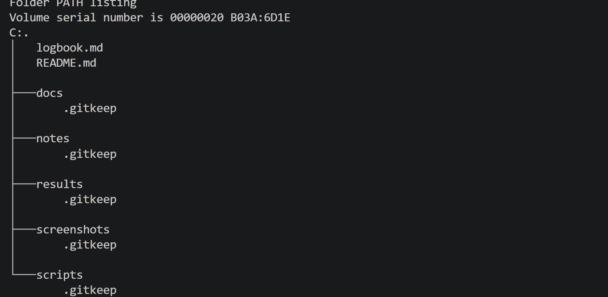

# Windows 11 Endpoint Security Lab — Logbook

## 2026-07-08 — Part 1: Project setup

### Goal

Create the documentation structure for the Windows 11 Endpoint Security Lab.

The purpose of this part was to prepare the project folder, documentation files, screenshot folder, results folder, notes folder and Git repository before starting the endpoint security review.

### Work completed

* Created the main project folder.
* Created the documentation folders.
* Created `README.md`.
* Created `logbook.md`.
* Created `.gitkeep` files so Git can track empty folders.
* Opened the project in VS Code.
* Initialized the local Git repository.
* Created the GitHub repository.
* Connected the local repository to GitHub.
* Pushed the initial project structure to GitHub.
* Captured project structure screenshot evidence.
* Updated the README to mark Part 1 as complete.

### Project structure

```text
Windows-11-Endpoint-Security-Lab/
├── docs/
├── notes/
├── results/
├── screenshots/
├── scripts/
├── logbook.md
└── README.md
```

### Tools used

| Tool | Purpose |
| --- | --- |
| File Explorer | Used to create and review the project folder. |
| VS Code | Used to edit Markdown files and manage the project structure. |
| PowerShell terminal | Used to create folders, create files and run Git commands. |
| Git | Used for local version control. |
| GitHub | Used to publish the project as portfolio evidence. |

### Commands used

```powershell
mkdir docs, notes, results, screenshots, scripts
New-Item README.md, logbook.md -ItemType File
New-Item docs\.gitkeep, notes\.gitkeep, results\.gitkeep, screenshots\.gitkeep, scripts\.gitkeep -ItemType File
tree /F
git init
git add README.md logbook.md docs notes results screenshots scripts
git commit -m "Initial project setup"
git remote add origin https://github.com/YOUR-USERNAME/Windows-11-Endpoint-Security-Lab.git
git branch -M main
git push -u origin main
```

### Command purpose

| Command | Purpose |
| --- | --- |
| `mkdir docs, notes, results, screenshots, scripts` | Creates the main project folders. |
| `New-Item README.md, logbook.md -ItemType File` | Creates the starter README and logbook files. |
| `New-Item docs\.gitkeep, notes\.gitkeep, results\.gitkeep, screenshots\.gitkeep, scripts\.gitkeep -ItemType File` | Creates placeholder files so Git can track empty folders. |
| `tree /F` | Shows the project folder structure and files. |
| `git init` | Initializes the local Git repository. |
| `git add` | Stages files for commit. |
| `git commit` | Creates a local Git checkpoint. |
| `git remote add origin` | Connects the local repository to GitHub. |
| `git branch -M main` | Renames the current branch to main. |
| `git push -u origin main` | Uploads the first local commit to GitHub and links the local branch to the remote branch. |

### Screenshot evidence

#### Initial project structure



### Notes

This lab documents a basic Windows 11 endpoint security review in a safe local environment.

The project is designed for practical IT support, desktop support, endpoint support and junior sysadmin portfolio use.

The lab will use GUI tools first, followed by PowerShell verification where useful.

No real user data, production systems, passwords, private files or company devices are used.
